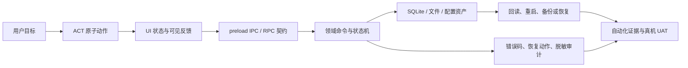

# 13 测试与运维

**版本**：v0.1.2
**日期**：2026-08-14
**状态**：✅ 已审查批准；T-M5-009 已完成受控 Git 收口，六项 `docs/traceability/` 基线资产可供后续任务消费；当前无执行中任务。
**上游**：[AGENTS.md §2、§5、§7、§9、§11](../AGENTS.md)、[01-TRD](./01-TRD-技术需求-Technical-Requirements.md)、[02-PRD](./02-PRD-产品需求-Product-Requirements.md)、[03-Architecture](./03-架构设计-Architecture-Design.md)、[05-ERD](./05-数据模型-ERD-Data-Model.md)、[06-API](./06-API契约-API-Contracts.md)、[07-Workflow](./07-工作流-Workflow.md)、[08-测试验收](./08-测试验收-Test-Plan.md)、[09-使用者介面](./09-使用者介面-UI-Design.md)
**下游**：[04-Todo](./04-任务清单-Todo-List.md)、任务唯一计划、实施记录、测试资产、发布与运维记录
**用途**：把用户动作、界面、运行时、领域逻辑、数据资产、错误处理、自动化测试、真机 UAT 与运维收敛为一条可追溯的交付链；它不是具体任务计划，也不取代 08-测试验收的测试分层与验收条款。

---

## 1. 文档定位

### 1.1 为什么需要第 13 份文档

系统构建经历需求分析、UI 设计、前端实现、后端实现、测试和运维。前四项已经形成可运行系统，但历史实施出现过前后端分别推进、再用完整 phase 补接的情形。其根因不是某一层单独“做得不够”，而是没有持续以同一份可审计设计把下列对象切开又串起来：

```text
用户目标 / 页面外观 / 原子动作 / UI 状态 / RPC 契约 / 领域命令 /
数据事实 / 失败与恢复 / 自动化测试 / 真机 UAT / 启动、备份、升级与故障处置
```

本文件定义该统一治理层。以后不以“前端完成”或“接口已通”作为完整交付的替代说法；每一个用户可见能力都必须能够沿上述链路追溯。

### 1.2 与既有文档的边界

| 文档 | 仍然负责 | 本文补足 |
|---|---|---|
| 01-TRD / 02-PRD | 技术与产品目标、边界、成功标准 | 将目标落到可统计的动作、错误、数据和运行证据 |
| 03-Architecture | 层次、进程、Adapter、数据根架构 | 每层对行为、失败、运行的责任界线 |
| 05-ERD | 表、关系、约束、备份结构 | 哪些用户交互产生何种数据资产、何时持久化、如何回读 |
| 06-API | RPC 契约和错误信封 | 每一个 RPC 与用户动作、错误语义、测试证据的映射 |
| 07-Workflow / 09-UI | 工作流、页面、控件、状态机 | 从控件到真实闭环的动作目录和可观测成功条件 |
| 08-测试验收 | 测试金字塔、运行隔离、E2E、真机 UAT 铁律 | 测试对象全集、覆盖统计、数据真实性、运维发布门禁 |
| 10-开发规范 | 开发过程和收尾纪律 | 测试与运维交付物的结构化内容 |

**不做的事**：本文不新增 RPC、表、错误码、全局状态、测试后门或任务；这些变更仍须通过设计裁决、04-Todo、唯一 `.plan/` 和用户授权。

### 1.3 核心原则

1. **完整垂直切片，而非前后端拼接**：一个能力从用户目标直到重启后的可见结果才算一条切片。
2. **事实优先**：测试和 UAT 使用隔离的真实 SQLite / 文件运行根；mock 只用于其被允许的层级，不得伪造系统业务验收事实。
3. **动作、控件、RPC、错误分别计数**：它们相关但不等价，禁止把控件数或 RPC 数冒充用户动作总数。
4. **失败是设计的一部分**：每个可达动作必须同时定义成功、失败、恢复、重试和不可恢复边界。
5. **生产可运行与可运维同等重要**：启动、数据根、SQLite 生命周期、备份恢复、升级卸载和脱敏日志均属于交付。
6. **可审计而不过度泄漏**：证据不得展示完整 UUID、绝对路径、密钥、学生资料原文或错误栈。

---

## 2. 全链路职责模型

### 2.1 六个可独立审查的层面

| 层面 | 回答的问题 | 典型产物 | 禁止越界 |
|---|---|---|---|
| 外观（presentation） | 用户看见什么、何时可点击、空态/加载/失败如何呈现 | UI 规格、控件清单、页面截图 | 直接读写 SQLite、拼装领域规则 |
| 交互（interaction） | 用户一次意图如何触发、取消、重试、返回 | `ACT-*`、页面状态转换 | 绕过统一 RPC 或伪造成功 |
| 运行（runtime） | Electron 进程、preload、IPC、权限和数据根如何承载 | 进程边界、启动/关闭策略 | 把业务规则塞入 renderer 或暴露 Node 能力 |
| 逻辑（domain） | 哪个命令改变什么业务状态、哪些前置条件成立 | handler / service / 状态机 | 依赖 UI 文案或把数据库错误原样给用户 |
| 数据（data） | 什么事实必须落盘、何处存放、如何回读与恢复 | 资产目录、schema、备份清单 | 把缓存、临时文件当正式事实 |
| 质量与运维（quality & operations） | 如何证明可用、可恢复、可交付和可诊断 | 测试矩阵、UAT、运行手册 | 用自动化注入或 mock 代替真机 UAT |

### 2.2 每项能力的最小闭环



一个节点缺失时，登记为“断裂”，不得以相邻节点已完成来宣称能力完整。

### 2.3 完整垂直切片检查表

每一个新能力或修订能力至少回答：

1. 用户是谁，目标是什么，入口页面和可见控件是什么；
2. 原子动作、前置条件、可见成功状态和取消路径是什么；
3. 对应哪个 RPC / stream、DTO 和领域命令；
4. 业务状态、SQLite / 文件 / 配置资产发生何种变化；
5. 失败分类、用户提示、重试/修复/回退和审计字段是什么；
6. 单元、集成、真实 Electron E2E、真机 UAT 分别证明什么；
7. 重启回读、备份恢复、升级或卸载是否受影响；
8. 有无跨层越界、未登记数据、临时 seed 或未授权范围扩张。

---

## 3. 用户交互动作目录（Interaction Catalog）

### 3.1 统计口径

| 对象 | 定义 | 能否等同于用户动作 |
|---|---|---|
| 页面 / Tab | 一个可见工作区域 | 否 |
| 控件（`CTRL-*`） | 按钮、输入框、链接、菜单等可操作元素 | 否；一个控件可对应多个动作 |
| 原子动作（`ACT-*`） | 用户为达成单一意图，在单一确认边界完成的一次操作 | 是；这是正式统计单位 |
| RPC / stream | 跨进程契约通道 | 否；一个动作可调用多个契约 |
| 领域命令 | 改变业务状态的逻辑单元 | 否；可能被多个动作复用 |
| 错误情形（`ERR-*`） | 动作在一个失败边界下的可预期结果 | 否；它是动作的负向覆盖项 |
| 测试（`TEST-*` / `E2E-*` / `UAT-*`） | 对动作或不变量的证据 | 否；它证明覆盖，而非动作本身 |

现有 `T-M5-001` 运行根内有 **60 个 `CTRL-*` 控件盘点项**，它是动作目录的输入基线，不是“系统共有 60 个用户动作”的结论。每个控件必须继续拆出查询、创建、保存、取消、删除、重试、返回、状态切换等实际原子动作，才可形成动作总数。

### 3.2 `ACT-*` 编号与目录字段

- 编号格式：`ACT-<领域>-<三位序号>`，例如 `ACT-S1-001`；编号一经发布不得因页面重排而重用。
- 一行只描述一个用户意图和一个确认边界；批量操作应另有“选择”“提交批量”“查看结果”等动作行。
- 如果同一控件在不同前置状态语义不同，应拆成不同动作或在同一动作内列出明确状态分支。

| 字段 | 必填说明 |
|---|---|
| `ACT-ID` / 动作名称 | 稳定编号和面向用户的简短名称 |
| 用户目标 / 页面 / 控件 | 为什么做、在哪里做、从哪个可见入口触发 |
| 前置条件 | 权限、选中课程、有效输入、网络/本机能力、业务状态 |
| 操作与确认边界 | 点击、输入、确认、取消、快捷键等；何时视为一次动作完成 |
| UI 状态 | idle / validating / submitting / success / empty / failed / disabled 等可见状态 |
| 契约与领域处理 | RPC / stream、handler / 状态机、必要的权限或参数校验 |
| 数据影响 | 读取或写入的 `DATA-*`，事务边界，文件副作用 |
| 可见成功条件 | 用户无需查看日志即可确认的结果 |
| 错误与恢复 | 关联 `ERR-*`、中文提示、可重试/不可重试、修复入口 |
| 并发与重启 | 重复提交、防抖、取消、崩溃后状态、重启回读 |
| 证据 | unit / integration / E2E / UAT ID、证据位置、当前覆盖状态 |
| 责任人与状态 | owning layer、实现/测试/UAT/运维状态和阻塞原因 |

### 3.3 覆盖统计

动作目录必须同时输出以下数字，且注明统计日期和筛选范围：

```text
动作总数 = 已登记 ACT 行数
自动化覆盖率 = 至少有一条有效自动化证据的 ACT / ACT 总数
负向覆盖率 = 已至少映射一个预期 ERR 的 ACT / ACT 总数
持久化覆盖率 = 涉及 DATA 写入且已验证重启回读的 ACT / 涉及 DATA 写入的 ACT 总数
真机 UAT 覆盖率 = 已有非注入式可见 UI 证据的 ACT / 需 UAT 的 ACT 总数
```

统计不允许把“控件可见”“RPC 存在”“renderer 脚本能执行”当作 UAT 覆盖。

### 3.4 动作目录审查规则

- `ACT` 不得没有用户可见成功条件；只有内部 API 的调用不是用户动作。
- 写入动作必须列出数据资产和重启行为；若不持久化，必须说明原因与失效时机。
- 删除、覆盖、导入、恢复、发送、外部副作用等高风险动作必须写取消、确认、幂等或补偿规则。
- 无纯 UI 创建入口的前置条件必须显式标记：它可以是自动化测试的启动前置，但**不能**拿来证明 UAT 的“创建→使用→重启”闭环。

---

## 4. 错误分类、责任与恢复

### 4.1 错误分类

| 类别 | 识别层 | 典型问题 | 用户处理原则 | 系统责任 |
|---|---|---|---|---|
| 输入 / 表单 | renderer + handler 双重校验 | 必填、格式、长度、非法字符 | 就近中文提示，保留用户输入 | UI 快速反馈；后端不可仅信任前端 |
| 前置状态 | UI 状态 + domain | 未选择课程、对象已删除、状态不允许 | 指向补足前置条件或刷新 | renderer 禁用是体验；handler 负责最终拒绝 |
| 领域业务 | handler / 状态机 | 重复、时间冲突、不可逆状态迁移 | 说明业务原因与可行下一步 | 使用稳定错误码，不泄漏实现细节 |
| 并发 / 生命周期 | domain + SQLite | 重复提交、过期写入、取消、重启中断 | 幂等结果、刷新或明确重试 | 事务、版本/状态校验、连接关闭 |
| 持久化 | data layer | FK / CHECK / trigger、磁盘满、数据库损坏 | 脱敏提示、保留可恢复输入、给出备份/重试入口 | 事务回滚、连接生命周期、诊断码 |
| 文件与本机能力 | main / adapter | 文件不存在、格式不支持、WPS/OCR/权限失败 | 指出动作与可执行修复，不展示路径或栈 | capability 校验、MIME/大小/路径防护 |
| 外部服务 | provider adapter | 超时、限流、格式异常、认证不可用 | 明示可否重试与是否已写入业务事实 | 设超时、幂等键、受控 mock、脱敏日志 |
| IPC / 安全 | preload / contract / main | 未授权通道、越权路径、payload 非法 | 统一安全失败提示 | 拒绝、记录 allowlist 审计，不暴露内部信息 |

### 4.2 责任切割

```text
renderer：可见校验、禁用/加载/失败/重试状态；不得决定最终业务有效性
preload / IPC：能力最小化、参数形状和通道白名单；不得承载业务规则
contract：稳定方法、DTO、错误码与可序列化边界；不得泄露堆栈或内部路径
handler / domain：前置、权限、状态机、幂等、事务和领域错误的最终裁决
data / filesystem：约束、事务、原子写入、路径与连接生命周期
operations：备份、恢复、迁移、安装、诊断与升级回退；不得读取敏感正文作为常规日志
```

“前端已禁用”不能取代 handler 前置检查；“SQLite 抛错”不能直接成为用户文案；“日志里有异常”不能取代用户可恢复路径。

### 4.3 错误条目模板

每个 `ERR-*` 至少包含：

| 字段 | 说明 |
|---|---|
| `ERR-ID` / 稳定 code | 与 06-API 错误信封及调用方一致；新增或变更 code 需修订 API 契约 |
| 触发动作与检测层 | 哪个 `ACT-*`，由哪一层首先识别 |
| 业务事实与技术原因 | 分开描述；技术原因不直接暴露给学生 |
| 用户文案与可行操作 | 中文、具体、无路径/UUID/stack/key；重试、返回、修复、联系支持或停止 |
| 可重试性 / 幂等性 | 是否可立即重试，重复请求是否安全 |
| 数据处理 | 未写入、原子提交、已提交待回读、补偿或人工恢复 |
| 审计与测试 | 允许记录的脱敏字段、负向测试和 UAT 观察点 |

---

## 5. 数据资产、SQLite 与生命周期

### 5.1 数据资产分类

| 类别 | 是否正式事实 | 默认持久化 | 示例 | 治理要求 |
|---|---|---|---|---|
| 业务事实 `DATA-BIZ-*` | 是 | SQLite / 受控文件 | 学期、课程、任务、资料元数据、作答、错题、模拟考 | 有 owner、schema/约束、回读与备份策略 |
| 用户配置与安全 `DATA-CFG-*` | 是，但非业务事件 | 配置文件 / DPAPI | 模型配置、凭证引用、偏好 | 最小读取、DPAPI、禁止入 Git / 日志 |
| 文件资产 `DATA-FILE-*` | 取决于业务绑定 | 业务数据根受控目录 | 导入资料、导出包、备份包 | 路径白名单、MIME、大小、生命周期和删改规则 |
| 记忆与索引 `DATA-MEM-*` | 分层确定 | JSON / 索引 / SQLite | L1 学习者画像、L2 索引、L3 会话 | 标出可重建性、敏感级别和恢复来源 |
| 缓存 / 临时 `DATA-TMP-*` | 否 | 可清理目录 / 内存 | 导入 capability、转换中间物、计算缓存 | 有 TTL/清理责任；不得当作唯一事实 |
| 测试运行数据 `DATA-TEST-*` | 否 | 隔离测试根 | 合成课程、专用 SQLite、截图、JSON 证据 | 永不连接或复制生产业务根；不进 Git |

### 5.2 当前业务数据根与已知落点

默认数据根由运行时解析为 `%LOCALAPPDATA%\PiStudyBuddy`；测试可以且必须通过 `PI_STUDYBUDDY_DATA_ROOT` 改指 `H:\pi-studybuddy-tmp\runs\<task-id>\...`。下表是当前权威设计和实现可核对的资产落点，实际业务语义仍以 05-ERD、schema 与运行时验证为准。

| 资产 | 当前落点 / 规则 | 生命周期与验证 |
|---|---|---|
| 全局 SQLite | `<dataRoot>/global.db` | 应用启动初始化；全局事实由 schema 约束；建库辅助返回前关闭连接 |
| 学期 SQLite | `<dataRoot>/semester/<semester-id>/sem.db` | 学期业务事实；测试库需保留真实 FK/CHECK/trigger |
| L1 画像 | `<dataRoot>/memory/l1/learner-profile.json` | 个人画像；须标明更新来源、备份与敏感性 |
| L2 索引 | `<dataRoot>/memory/l2/wiki-index` | 可索引/可重建性需在资产目录中明确 |
| L3 会话 | `<dataRoot>/memory/l3/conversation.sqlite` | 对话会话资产；需服从脱敏、备份和恢复规则 |
| 模型 / 凭证配置 | `<dataRoot>/config/` 下的受控配置；凭证使用 Windows DPAPI | 禁止写入 Git、日志或 UAT DOM |
| 资料导入暂存 | `<dataRoot>/imports/materials/<token>` | 一次性 capability；消费后移除，失败时清理临时文件 |
| 课程资料正式文件 | 受限于 `<dataRoot>/semester/...` 的 `storageKey` | 只允许位于 semester 根下；导入成功后与资料元数据一致 |
| 导出与备份 | `<dataRoot>/exports/` 及 05-ERD 定义的备份结构 | 必须定义可发现、校验、恢复与失败补偿 |

`initializeDataRoot()` 还创建根级 `storage/` 目录；而资料导入的正式目标限制在 `semester/` 下。该目录目的与资产归属应在首次审查本文件时核对：未确认前，不得把根级 `storage/` 当成课程资料唯一正式事实，也不得删除它来“消除差异”。

### 5.3 数据资产目录字段

每一类 `DATA-*` 至少登记：

| 字段 | 说明 |
|---|---|
| 数据名称 / owner / 来源动作 | 哪个领域拥有；由哪些 `ACT-*` 创建、读取、变更、删除 |
| 是否持久化及介质 | SQLite 表 / JSON / 文件 / 索引 / 内存；不可只写“数据库” |
| 真相来源与可重建性 | 是否唯一正式事实；能否由其他数据重建 |
| 约束与事务 | PK/FK/CHECK/trigger、原子写入、文件—数据库双写的补偿 |
| 隐私与日志等级 | 敏感级别、允许显示和允许审计的字段 |
| 重启 / 备份 / 恢复 | 重启回读断言、备份包含范围、恢复覆盖规则 |
| 测试策略 | 合成夹具、专用库、E2E、UAT 是否可创建和验证 |

### 5.4 SQLite 连接与副作用纪律

1. 业务进程保持单机、单用户、单写进程边界；SQLite 打开、事务、关闭责任必须明确。
2. 建库 / fixture 辅助函数返回前关闭连接，尤其在 Windows 上不得遗留 WAL/SHM 句柄阻碍清理或随后 Electron 独占打开。
3. 任何文件—数据库组合操作须定义顺序、失败补偿和孤儿文件处理；不得只在 happy path 写入。
4. 生产根、测试根、pi 会话根物理隔离；测试禁止读取、复制、覆盖或查询真实学生数据根。
5. 新增持久化事实前，先更新 05-ERD、资产目录、错误条目和备份影响，再开始实现。

---

## 6. 测试真实性与证据分层

### 6.1 四类证据各自证明什么

| 层级 | 可使用的替身 | 必须使用的事实 | 能证明 | 不能证明 |
|---|---|---|---|---|
| 单元测试 | mock / fake 合法 | 纯规则和边界输入 | 规则、转换、错误映射、组件局部状态 | 实际 IPC、SQLite、Electron 或用户可用性 |
| 集成测试 | 外部 provider 可 mock | 正式 schema、handler、contract 组合 | 事务、约束、DTO、领域错误和真实专用数据库 | 完整桌面壳和原生用户操作 |
| 真实 Electron E2E | 外部服务按 08-测试验收受控 mock | 独立 SQLite、真实进程、preload/IPC/renderer | 应用链路、重启、可见 DOM、回归 | 非注入式原生真机 UAT（若通过 renderer/CDP/handler 注入驱动） |
| 真机 UAT | 不得用 runtime seed / handler 绕过 / renderer 注入代替用户动作 | 全新隔离数据根、真实 Electron、可见 UI 输入 | 学生实际可达、创建→使用→重启持久化、逐页逐按钮可用性 | 内部实现质量或所有极端负向路径 |

### 6.2 测试数据铁律

1. 全部测试数据位于 `H:\pi-studybuddy-tmp\runs\<test-task-id>\`；不得污染 `%LOCALAPPDATA%\PiStudyBuddy`。
2. 数据库型测试建立专用 `global.db` 与 `semester/<semester-id>/sem.db`，保留真实 schema、FK、CHECK 与 trigger。
3. 优先通过正式 schema 和正式 handler 建立自动化前置；无公开入口的前置只可在 Electron 启动前写入专用测试库，并须标记为“自动化前置，非 UAT 创建证据”。
4. 禁止提供 `test.*` RPC；禁止在运行中的 application handler 里 seed。
5. 组件级 mock 只可证明该组件的显示、重试或禁用语义，不能被提升为系统业务数据验收。
6. 真实外部 AI、SMTP、Webhook 等仍按 08-测试验收规定 mock；“不依赖 mock 数据”指不得拿 mock 伪造业务数据库事实，不等于测试必须调用真实外部服务。

### 6.3 UAT 证据最低格式

每条 `UAT-*` 必须包含：隔离根标识（不在 DOM 展示绝对路径）、前置空态、全程可见 UI 操作、关键截图/DOM/JSON、动作结果、重启回读、失败观察、执行日期和结论。缺少创建、使用或重启任一段时，只能记为“局部可达性证据”，不得记为闭环。

---

## 7. 测试矩阵与质量门

### 7.1 最小可追溯矩阵

| 链路 | 必须可追溯到 |
|---|---|
| 需求 | PRD / TRD 条款 → `ACT-*` |
| 界面 | UI 页面 / `CTRL-*` → `ACT-*` |
| 运行与接口 | `ACT-*` → RPC / stream / handler |
| 数据 | `ACT-*` → `DATA-*` / schema / 文件生命周期 |
| 错误 | `ACT-*` → `ERR-*` → 用户恢复动作 |
| 自动化 | `ACT-*` / `ERR-*` → unit / integration / E2E |
| 用户可用性 | 需 UAT 的 `ACT-*` → 非注入式 `UAT-*` |
| 运维 | 持久化 / 配置 / 文件动作 → 启动、重启、备份恢复、升级影响 |

### 7.2 发布前的分级门禁

| 门禁 | 必须满足 |
|---|---|
| 设计完整性 | 新增或变更能力已有 `ACT`、`ERR`、`DATA`、owner 和边界；跨层断裂已登记 |
| 自动化质量 | 08-测试验收规定的质量门通过；负向、持久化、重启和安全不变量覆盖不缺失 |
| 数据安全 | 无生产数据根访问、无 runtime seed / 测试后门、无敏感数据或密钥进入日志/Git/DOM |
| 真机可用性 | 每个用户可见闭环完成真实 Electron 的创建→使用→重启 UAT；renderer 自动化不可替代 |
| 运维可恢复 | 启动、关闭、备份/恢复、异常诊断、升级/卸载影响已经按影响范围验证或显式阻塞 |
| 治理收尾 | 04-Todo、实施记录、计划状态、文档治理检查、master 复验、origin/master 推送和用户 Git 授权按 AGENTS.md 完成 |

任何一个门禁不足时，记录为 in_progress 或 blocked；不得以“测试全绿”单独宣称正式发布就绪。

---

## 8. 运维与正式交付

### 8.1 启动和运行健康

每个发布候选必须验证并记录：

- 安装后的首次启动、再次启动、异常退出后的再启动；
- 数据根解析优先级（隔离环境变量与默认 `%LOCALAPPDATA%\PiStudyBuddy`）；
- 数据根目录、SQLite 初始化、连接关闭和进程独占边界；
- Electron main / preload / renderer / agent-host 的可用性和 IPC 安全边界；
- 本地依赖（Node/Electron 运行时、WPS/OCR/whisper 等按其适用范围）的“可用 / 不可用但可恢复”状态；
- 只记录 allowlist 脱敏诊断，不记录请求正文、模型完整输出、base URL、密钥、完整 UUID、绝对路径或错误栈。

### 8.2 备份、恢复、迁移、升级与卸载

| 场景 | 必须回答 |
|---|---|
| 备份 | 哪些 `DATA-*` 和文件包含、完整性如何校验、敏感内容如何处理、失败后是否留下可辨识残件 |
| 恢复 | 目标数据根、覆盖/合并规则、版本兼容性、回滚或停止条件、恢复后如何回读验证 |
| schema / 数据迁移 | 版本标识、向前/向后兼容、备份前置、失败原子性、重试与人工恢复路径 |
| 升级 | 旧版本数据是否可打开、凭证是否保持 DPAPI 边界、升级失败怎样回到可启动状态 |
| 卸载 | 程序文件与用户数据分开；不得未经用户明确确认删除业务数据、备份或凭证 |
| 支持诊断 | 最小化、脱敏、可导出但不含学生原文/密钥/完整路径/栈的状态摘要 |

### 8.3 发布包与运行环境责任

“源码可运行”与“可安装、可恢复、可维护”是两项不同证据。包体、运行时依赖、首次运行、离线边界、升级兼容性和卸载数据保留策略都必须有明确测试对象；没有证据时应标注未覆盖，而非假定打包成功等于正式交付成功。

---

## 9. 当前基线、缺口与后续产物

### 9.1 当前基线（截至 2026-08-14）

- 现有设计文档已覆盖需求、UI、架构、ERD、API、工作流和测试分层；本文件补充它们之间的行为、错误、数据和运维追溯。
- 已有 `CTRL-*` 控件盘点（60 项）可作为动作目录的起点；尚未得到正式 `ACT-*` 用户动作总数，不能预填或猜测。
- 自动化测试必须使用隔离的专用 SQLite；外部服务仍按测试计划采用受控替身。
- 真实 Electron 的 renderer 自动化与非注入式真机 UAT 是不同证据类型，二者不得混称。
- 本文已获审查批准；T-M5-009 已完成，已将本节长期交付物首次落为受控基线；用户任务特定地认可本无 Electron UI 变更任务的受控文档消费路径验收为 PASS，并完成授权 Git 收口。该任务特定例外不得外推为应用真机 UAT，也不替代后续 M5 业务任务的真实 UAT。

### 9.2 必须形成的长期交付物

| 产物 | 内容 | 生成时机 |
|---|---|---|
| `interaction-catalog` | `CTRL-*` 到 `ACT-*` 的动作全集、统计和覆盖状态 | 测试阶段总盘点；功能变更时同步 |
| `error-catalog` | `ERR-*`、错误码、责任、用户恢复和负向证据 | 每个领域/契约变更时同步 |
| `data-asset-catalog` | `DATA-*`、SQLite/文件/配置落点、生命周期、备份与测试策略 | 数据模型或存储变更时同步 |
| `system-traceability` | UI→运行→逻辑→数据→测试→运维的矩阵 | 发布前与重大 phase 收尾 |
| `operations-runbook` | 启动、备份恢复、升级、卸载、诊断、依赖健康和事故处置 | 发布候选前，按版本维护 |
| `release-evidence` | 自动化结果、UAT、数据根隔离、安装/升级/恢复和 Git 证据 | 每次受控收尾 |

这些产物应按任务粒度放在受控计划、记录或指定文档位置；创建新任务、实现新入口、增加 API/schema 或执行 Git 收口仍须单独获得用户授权。

### 9.3 停止条件

立即停止业务施工并请求裁决，当出现任一情况：

- `ACT`、`ERR`、`DATA` 三者无法确定，或现有设计文件彼此冲突；
- 为了测试而需要连接真实业务根、运行时 seed、未登记 test RPC 或绕过 UI；
- UAT 只能靠 renderer/CDP/handler/数据库注入才能到达所谓闭环；
- 需要新增 API、schema、handler、stream、跨 Tab 全局状态或跨任务能力；
- SQLite/文件的正式落点、所有者、备份或恢复语义不明；
- 准备把自动化通过、局部可达性、截图存在或历史提交当作“任务 done / 正式发布”的替代证据。

---

## 10. 评审与版本历史

### 10.1 已批准的裁决与实施边界

1. **动作治理批准**：采用 `CTRL-* → ACT-*` 的两层目录；控件、原子用户动作、RPC/领域命令及负向情形分开统计，不以控件总数替代动作总数。
2. **错误治理批准**：采用 `ERR-*`、错误类别、责任层、用户可恢复动作、日志边界和负向证据的统一条目；错误必须先明确归属，再定义界面呈现与恢复。
3. **数据资产治理批准**：采用 `DATA-*` 目录，作为 05-ERD 的长期补充；必须覆盖 SQLite、文件、配置、凭证、临时运行数据与备份的所有者、正式落点、生命周期和回读策略。
4. **SQLite 落点核对批准**：对根级 `storage/`、`semester/.../storageKey` 及其真实运行根实施受控现状盘点；盘点结论不得凭文档猜测，必须以代码、隔离运行证据和必要时的 SQLite 回读共同确认。
5. **方案 B 批准**：发布前运维门禁和上述目录不挤入既有业务任务；新增专门治理任务 **T-M5-009 测试与运维追溯基线建立**，先登记为 `pending`。
6. **开工边界**：T-M5-009 是本文批准后的首个治理实施任务；它获得开工授权前，不创建详细 `.plan/T-M5-009-*.md`、不建立实施分支、不改业务代码或数据。M5-005~008 后续按其产物补齐各自范围内的实际证据，不因本文批准而自动开工。

### 10.2 版本历史

| 版本 | 日期 | 变更 | 原因、影响与依据 |
|---|---|---|---|
| v0.1.2 | 2026-08-14 | 同步 T-M5-009 完成事实：功能/基线提交 `156756c` 已 ff-only 合并 master，Node24 master `verify --stage=full` 最终重跑通过（131 files/1195 tests、真实 Electron E2E 33 files/141 tests），治理登记推送和 `master=origin/master` 同位核验完成；六项追溯基线资产由 in_progress→done。用户认可 `T-M5-009-DOC-CONSUMER-001` PASS 仅替代该无 Electron UI 变更任务的真机 UAT，例外不外推。原因：修复当前状态滞后；影响：不改本文规范、业务 API/schema/handler/入口或数据。依据：用户明确批准 + AGENTS.md §2、§7、§8.4、§11。 |
| v0.1.1 | 2026-08-14 | 审查批准；固化 ACT/ERR/DATA 三类治理口径、SQLite 现状核对与方案 B；登记 T-M5-009 为专门治理任务（pending）。 | 原因：用户明确批准本文并选择方案 B。影响：新增受控任务和长期交付物所有权；不启动实施、不新增业务 API/schema/handler/入口、不写生产数据、不执行 Git 收口。依据：用户本次明确授权 + AGENTS.md §2、§4.4、§7、§8、§11。 |
| v0.1.0 | 2026-08-13 | 初始草案：定义用户动作目录、错误责任、数据资产/SQLite 生命周期、测试真实性、UAT、发布与运维门禁。 | 原因：用户要求将测试阶段治理 prompt 演化为 docs 第 13 份文档。影响：新增统一可追溯标准，不改业务功能/API/schema/任务状态。依据：用户明确指令 + AGENTS.md §2、§5、§7、§9、§11。 |